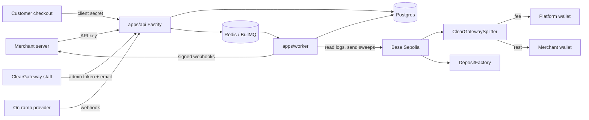
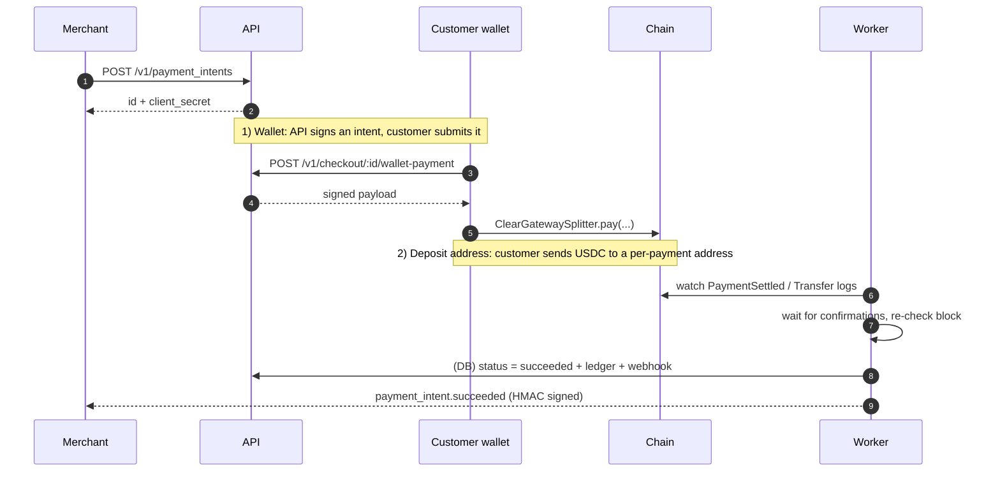
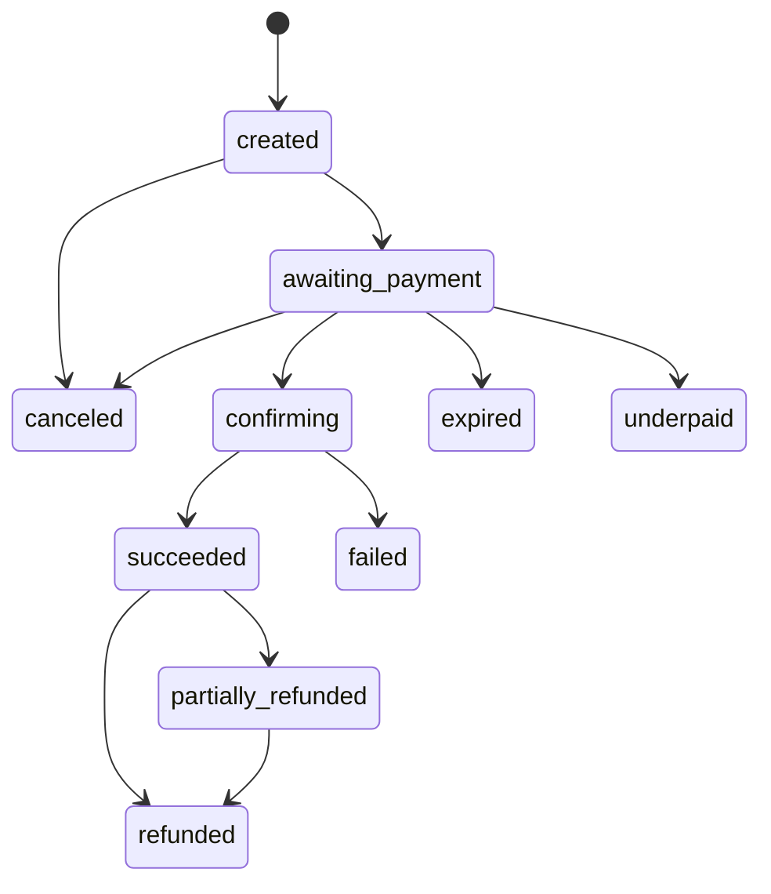

# ClearGateway (Phase 1)

A **non-custodial stablecoin payment platform**. A merchant asks for a payment in USDC; the customer pays; the money goes
**straight to the merchant's wallet** (minus ClearGateway's fee) through a smart contract. ClearGateway never holds customer funds.

> **Testnet only.** Base Sepolia (chain id 84532). There are no mainnet deploy scripts and the API refuses live-mode keys.

## What is built, in plain English

| Piece | What it does |
| --- | --- |
| **Smart contracts** (`contracts/`) | `ClearGatewaySplitter` takes a customer's USDC and splits it in one atomic step: fee to ClearGateway, the rest to the merchant. `DepositFactory` makes a unique "deposit address" per payment, so a customer can pay by plain transfer from any wallet or exchange. No contract has a withdraw function or an owner who can take funds. |
| **API** (`apps/api`) | What merchants call to create payments, list them, request refunds and manage webhooks. It also serves the hosted-checkout calls and the internal staff API. |
| **Worker** (`apps/worker`) | Background jobs that watch the blockchain and do the slow work: detect payments, wait for confirmations, expire unpaid ones, send webhooks to merchants, sweep deposit addresses, run reconciliation. |
| **Database** (`packages/db`) | Postgres. Holds payments, a double-entry ledger, webhooks and an append-only audit trail. A **state machine** is the only code allowed to change a payment's status. |
| **Web app** (`apps/web`) | Next.js. The hosted **checkout page** customers pay on, the **merchant dashboard** and the **staff console**. It talks to the API only; it holds no money logic. |
| **Card / Apple Pay** (`packages/onramp`) | Lets a customer buy USDC with a card, into their *own* wallet, which then pays as usual. Only a mock provider works today; Wert and Simplex are stubs waiting for sandbox credentials. |

Rules the system enforces: money is always integer base units (USDC has 6 decimals, never floats); fees are in basis points
and round down; every money-changing POST needs an `Idempotency-Key`; **the blockchain is the source of truth** (only the
chain watcher can mark a payment `succeeded`, after N confirmations and a final re-check for reorgs); no secrets or PII in logs.

## Architecture



## Payment flows



The third method, **card**, funds the customer's own wallet through an on-ramp provider, then follows the wallet flow.

## Payment state machine



Late, overpaid and stuck payments never change status by themselves: they are flagged `needs_review` for staff.

## Repo layout

```
apps/api        Fastify API (merchant /v1, checkout, inbound webhooks, internal /internal/v1)
apps/web        Next.js: hosted checkout (/pay/<id>), merchant dashboard (/dashboard), staff console (/admin)
apps/worker     BullMQ jobs (watchers, confirmations, expiry, webhooks, sweeper, reconciliation, on-ramp)
packages/shared money math, ids, API-key helpers, queue names
packages/db     Drizzle schema, migrations, state machine, seed
packages/chain  viem client, EIP-712 signing, deposit-address math
packages/onramp on-ramp provider interface + mock (+ Wert/Simplex stubs)
contracts/      Foundry project (OpenZeppelin), tests, Sepolia deploy scripts
scripts/        export-abi.mjs
```

## Setup

Requirements: Node 22+, pnpm, **Docker Desktop** (Postgres, Redis, a local Anvil chain and Foundry all run in Docker; you do
not install Foundry).

```bash
git clone --recurse-submodules <repo>     # contracts/lib holds OpenZeppelin + forge-std
pnpm install
cp .env.example .env                      # then fill in the secrets below
docker compose up -d                      # postgres :5433, redis :6379, anvil :8545
pnpm build
pnpm db:migrate
pnpm db:seed                              # a staff admin (SEED_ADMIN_EMAIL, default admin@cleargateway.local) + default routing
pnpm dev:api                              # http://localhost:3000  (Swagger UI at /docs)
pnpm dev:worker                           # in a second terminal
cp apps/web/.env.example apps/web/.env.local   # set SESSION_SECRET (openssl rand -hex 32)
pnpm dev:web                              # http://localhost:3001
```

Generate each secret with `openssl rand -hex 32`: `ADMIN_TOKEN`, `CLIENT_SECRET_KEY`, `ENCRYPTION_KEY`. Never commit `.env`
(it is git-ignored). Private keys (`SIGNER_PRIVATE_KEY`, `RELAYER_PRIVATE_KEY`) and contract deployment are **not** needed for
local development or the test suite; do them only when you are ready to test on Base Sepolia.

## The web app (`apps/web`)

| URL | Who | Sign in with |
| --- | --- | --- |
| `/pay/<payment id>#client_secret=...` | Customers (the merchant sends the link) | nothing: the secret in the link is the credential |
| `/dashboard` | Merchants: payments, create payment links, refund requests, webhooks | email + password (roles: owner, admin, developer, read-only viewer) |
| `/admin` | ClearGateway staff: merchants, KYB, fees, API keys, dashboard users, staff accounts, payment search, review queue, refunds, reconciliation | personal email + password + authenticator-app code |
| `/accept#token=...` | Anyone with an invite or password-reset link | the one-time link |

How it stays safe: the dashboard and console call the API through a server-side proxy. The session token is kept in an
AES-256-GCM encrypted, `httpOnly`, `SameSite=Strict` cookie, never in page JavaScript. State-changing calls also need a
CSRF header and a same-origin `Origin`. The checkout page reads its client secret from the URL fragment (never sent to a
server), then removes it from the address bar. Amounts are parsed and shown with integer math only.

Checkout needs a browser wallet (MetaMask, Coinbase Wallet...) on Base Sepolia holding test USDC, and the API must have
`SPLITTER_ADDRESS`, `SIGNER_PRIVATE_KEY` and (for the exchange tab) `DEPOSIT_FACTORY_ADDRESS` set, which means contracts must be
deployed. The card tab is a placeholder until Wert/Simplex sandbox credentials exist.

Web env (`apps/web/.env.local`): `API_BASE_URL` (server to API), `NEXT_PUBLIC_API_BASE_URL` (browser to API; the API's
`CHECKOUT_ORIGIN` must equal the web app's origin), `SESSION_SECRET`.

## Accounts and sign-in

- **Passwords** are hashed with scrypt; minimum 12 characters. There are no default passwords: an account is created by an
  **invite link**, opened at `/accept`, where the person chooses their password. There is no email service yet, so whoever
  creates the invite (a staff member, or `pnpm db:seed` for the very first staff and merchant owner) hands over the link
  privately. Links work once and expire after 72 hours. **Reset** works the same way and also signs the person out everywhere.
- **Staff must use two-factor** (a TOTP authenticator app: Google Authenticator, 1Password, Authy...). It is set up while
  accepting the invite. A code cannot be used twice.
- **Sessions** are stored server-side (only a hash of the token), last 8 hours, end after 2 hours idle, and are revoked by
  sign-out, password change, reset or disabling the account.
- **Lockout**: 5 wrong passwords lock the account for 15 minutes; sign-in and invite routes are also rate limited per IP
  (`AUTH_RATE_LIMIT_PER_MIN`). Errors never reveal whether an email has an account.
- **Merchant roles**: owner, admin and developer have full access; **viewer** is read-only. API keys remain the credential
  for a merchant's own servers.
- **First run**: `pnpm db:seed` prints one-time setup links for `admin@cleargateway.local` (change with `SEED_ADMIN_EMAIL`) and a
  test merchant owner. Open `http://localhost:3001/accept#token=<token>`. Needs `ENCRYPTION_KEY` in `.env`.
- **SSO** (Google/Microsoft/Okta...) is **not built**: it needs a provider chosen and its credentials. The database already has a
  reserved `auth_provider_id` column, and sign-in ends in one place (issuing a session), so it can be added without redoing this.

## Using the internal (staff) API

Base path `/internal/v1`. Sign in at `POST /auth/v1/admin/login` (email, password, `totp_code`) and send `Authorization: Bearer <session token>`.
For scripts there is also a legacy shared-secret mode, used only when `ADMIN_TOKEN` is set: send **both** headers below. Leave `ADMIN_TOKEN`
unset in production so no shared secret exists:

```
Authorization: Bearer <ADMIN_TOKEN>
X-Admin-Email: <email of a row in admin_users>
```

Every state change is written to the append-only
`admin_audit_log` in the same transaction as the change.

| Area | Endpoints |
| --- | --- |
| Staff | `GET/POST /staff`, `POST /staff/:id/{reset,disable,enable}` |
| Dashboard users | `GET/POST /merchants/:id/users`, `PATCH /merchant-users/:id`, `POST /merchant-users/:id/{reset,disable,enable}` |
| Merchants | `POST/GET /merchants`, `GET/PATCH /merchants/:id`, `POST /merchants/:id/{approve-kyb,reject-kyb,suspend,reinstate}`, `PATCH /merchants/:id/fee`, `PUT /merchants/:id/onramp-routing` |
| API keys | `POST/GET /merchants/:id/api-keys`, `DELETE /merchants/:id/api-keys/:keyId` (raw key shown once) |
| Payments | `GET /payment_intents` (filters), `GET /payment_intents/:id` (with event trail) |
| Review queue | `GET /review-queue?category=` (late_payment, overpaid, underpaid, stuck_deposit, chain_mismatch, other), `POST /review-queue/:intentId/resolve` |
| Refunds | `GET /refunds`, `POST /refunds/:id/{approve,reject}` |
| Reconciliation | `POST /reconciliation/run` (queues a run), `GET /reconciliation/runs[/:id]` |

Refunds are **recorded, not executed**: merchants request them (`POST /v1/refunds`), staff approve or reject, and the money
movement itself is a later phase.

## Merchant API overview (`/v1`, `Authorization: Bearer sk_test_...`)

`payment_intents` (create/get/list/cancel), `refunds`, `balance`, `webhook_endpoints`. Checkout calls
(`/v1/checkout/:id/{wallet-payment,deposit-address,onramp-session}`) use the payment's client secret instead of an API key.
Inbound: `POST /webhooks/chain/:provider` and `POST /webhooks/onramp/:provider` (signature-verified). Full schema: `/docs`.

## Environment variables

`.env.example` is the source of truth and documents every variable inline. Summary:

| Group | Variables |
| --- | --- |
| Runtime | `NODE_ENV`, `LOG_LEVEL`, `PORT`, `HOST`, `SENTRY_DSN` |
| Data | `DATABASE_URL` (Docker Postgres is on port **5433**), `REDIS_URL` |
| Chain | `CHAIN_ID` (84532 only), `RPC_URL`, `USDC_ADDRESS`, `SPLITTER_ADDRESS`, `DEPOSIT_FACTORY_ADDRESS`, `CONFIRMATIONS` |
| Deploy-time only | `SIGNER_ADDRESS`, `OWNER_ADDRESS`, `MAX_FEE_BPS` |
| Platform | `PLATFORM_WALLET_ADDRESS`, `CHECKOUT_ORIGIN`, `CHECKOUT_BASE_URL` |
| Secrets | `ADMIN_TOKEN` (optional legacy staff mode), `CLIENT_SECRET_KEY`, `ENCRYPTION_KEY`, `SIGNER_PRIVATE_KEY`, `RELAYER_PRIVATE_KEY` (testnet only) |
| API hardening | `TRUST_PROXY`, `RATE_LIMIT_PER_KEY_PER_MIN`, `RATE_LIMIT_PER_IP_PER_MIN`, `AUTH_RATE_LIMIT_PER_MIN`, `SIGNATURE_MAX_TTL_SECONDS` |
| Webhooks / on-ramp | `WEBHOOK_ALLOW_PRIVATE_URLS` (dev only), `WEBHOOK_TIMEOUT_MS`, `CHAIN_WEBHOOK_MOCK_SECRET`, `ONRAMP_MOCK_SECRET` |
| Watcher | `WATCHER_START_BLOCK`, `WATCHER_MAX_RANGE`, `REORG_REWIND_BLOCKS`, `REORG_GRACE_SECONDS`, `WATCHER_STALE_SECONDS`, `*_INTERVAL_MS` |
| Expiry / deposits | `EXPIRY_GRACE_SECONDS`, `DEPOSIT_INTERVAL_MS`, `DEPOSIT_LATE_LOOKBACK_DAYS` |
| Sweeper | `SWEEP_INTERVAL_MS`, `SWEEP_SIGNATURE_TTL_SECONDS`, `SWEEP_MAX_ATTEMPTS`, `SWEEP_RETRY_BACKOFF_SECONDS` |
| Reconciliation | `RECONCILE_CRON`, `RECONCILE_MAX_LOOKBACK_BLOCKS` |
| On-ramp worker | `ONRAMP_INTERVAL_MS`, `ONRAMP_BATCH_SIZE` |
| Tests | `ANVIL_RPC_URL` |

## Running the tests

Docker Desktop must be running with the stack up (`docker compose up -d`). Tests create and drop their own throwaway
databases (`belkpay_test_*`) and use Redis DBs 1 and 2, so they never touch your dev data.

```bash
pnpm build && pnpm lint && pnpm typecheck
pnpm test                          # every TypeScript package (shared, chain, db, onramp, api, worker, web)
pnpm --filter @belk/api test       # one package
pnpm contracts:test                # Foundry contract tests, run inside Docker
pnpm reconcile                     # one-off reconciliation run against your configured chain
```

The worker E2E tests run against the local Anvil chain, deploying the real contracts to it.

## Security notes

- API keys stored as SHA-256 and compared in constant time; webhook secrets AES-256-GCM at rest; client secrets are HMAC-derived.
- Webhooks are HMAC signed (`ClearGateway-Signature`), retried with backoff, and URL-checked against SSRF.
- Rate limits per key and per IP; `TRUST_PROXY` is off unless you sit behind your own proxy.
- `admin_audit_log` and the ledger are append-only (database triggers). Deposit factory `rescue` and `sweep` have no admin.
- See `contracts/SECURITY.md` for the contract threat model.

## Open items (`TODO(verify)` and product decisions)

- Wert and Simplex on-ramp integrations are stubs (need sandbox credentials and their real webhook formats).
- Chain-webhook providers other than `mock` are unverified.
- Refund cap is the **gross** amount paid; whether ClearGateway's fee is returned on refund is undecided.
- Changing a merchant's payout wallet via the staff API is high-risk; it is audited, but dual approval is recommended.
- SSO is not built (see Accounts and sign-in). Invite and reset links are not emailed yet (no email provider chosen).
- Staff-created merchants and API keys are not idempotency-keyed (low volume, visible in lists).
- Not done by design: deploying contracts, relayer/signer keys, refund execution.
- The wallet and exchange-transfer checkout paths, and the pages that need a live payment, have not been exercised in a real browser with a wallet yet (needs deployed contracts). That is the from-scratch test phase.

## Troubleshooting

- **`ECONNREFUSED 5433`**: the Docker containers stopped. Run `docker compose up -d`.
- **Port 5432 vs 5433**: Docker Postgres uses 5433 to avoid clashing with a local Postgres; check `DATABASE_URL`.
- **Tests hang or fail on Redis/Anvil**: `docker compose ps` should show postgres, redis and anvil healthy.
- **`.env` looks corrupted**: recreate it from `.env.example` and regenerate the secrets.
- **`next build` fails with `<Html> should not be imported`**: your shell has `NODE_ENV` set to something other than production (for example after loading `.env`). Run it with `NODE_ENV` unset.
- **Changed `packages/db` exports and other packages don't see them**: `pnpm --filter @belk/db build`.
